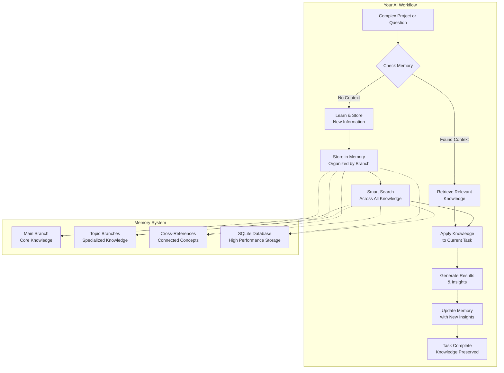

# Agentic Memory Server

**Enterprise-grade persistent memory for AI assistants - completely offline and secure.**

## Overview

The Agentic Memory Server provides your AI with intelligent, persistent memory that works entirely offline. No internet required, no data breaches, complete privacy. Your project's knowledge stays local and secure while enabling powerful AI assistance.



## What This Does for You

| Before Agentic Memory                            | With Agentic Memory                                              |
| ------------------------------------------------ | ---------------------------------------------------------------- |
| I have to constantly re-explain project details  | **Persistent Memory**: AI remembers your codebase and decisions. |
| The AI forgets everything between conversations. | **Continuous Learning**: The AI builds expertise over time.      |
| No way to organize knowledge by domain.          | **Branch Organization**: Separate knowledge by topic/domain.     |
| Can't find related information across projects.  | **Smart Search**: Intelligent search across all your knowledge.  |

## Key Features

### Complete Offline Operation

- **Zero internet dependency** - works entirely local to your machine
- **No data transmission** - your project knowledge never leaves your system
- **Enhanced security** - eliminates external attack vectors and data breach risks
- **Team collaboration** - SQLite database can be shared with your project for instant team onboarding

### High-Performance Architecture

- **Sub-second search responses** across thousands of entities
- **SQLite-powered storage** with intelligent indexing and query optimization
- **Smart relevance scoring** - name matches (10pts) > type matches (8pts) > content matches (3pts)
- **Memory optimization** - automatic text compression and storage efficiency

### Intelligent Organization

- **Branch-based architecture** - organize knowledge by domain (frontend, backend, security, etc.)
- **Cross-branch search** - find related information across your entire project
- **Auto-relationship detection** - automatically connects related concepts
- **Smart observation management** - detailed technical knowledge with version tracking

## Getting Started

### 1. Installation & Configuration

Install the agentic memory server:

```bash
npm install -g @prism.enterprises/agentic-memory-server
```

Or run directly with npx:

```bash
npx @prism.enterprises/agentic-memory-server
```

### 2. IDE Configuration

Add to your IDE's MCP configuration (e.g., Cursor's `mcp.json`):

```json
{
  "mcp": {
    "servers": {
      "contextual-memory": {
        "command": "npx",
        "args": ["@prism.enterprises/agentic-memory-server"],
        "env": {
          "MEMORY_PATH": "/path/to/your/project",
          "LOG_LEVEL": "info"
        }
      }
    }
  }
}
```

### 3. Basic Usage

**Create organized knowledge branches:**

```
Create a memory branch called "api-design" for our REST API architecture
```

**Store complex technical information:**

```
Remember that our Kafka cluster processes 500 million events daily with 12 brokers and replication factor 3
```

**Intelligent search across domains:**

```
Search for "authentication" across all branches
Search for "database optimization" in the backend-apis branch
```

**Cross-reference related components:**

```
Link the frontend auth guard to the OAuth2 integration in the security branch
```

## Memory Storage Structure

```
your-project/
├── .memory/
│   ├── memory.db          # SQLite database (main storage)
│   ├── backups/           # Automatic JSON backups
│   │   ├── main_2024-01-15.json
│   │   └── frontend_2024-01-15.json
│   └── logs/              # Operation logs
├── your-code/
└── ...
```

**Commit `.memory/` to version control** for team collaboration and project continuity.

## Advanced Features

### Smart Search Examples

- `"microservices distributed system"` → Finds service mesh, orchestration, scaling components
- `"real-time stream processing"` → Returns Kafka, Flink, event sourcing entities
- `"API gateway rate limiting"` → Discovers security, routing, performance entities

### Branch Organization

- **Technical domains**: `microservices-architecture`, `kubernetes-deployment`
- **Business domains**: `payment-processing`, `customer-experience`
- **Infrastructure**: `monitoring-observability`, `distributed-caching`

### Team Collaboration

- **Shared SQLite database** - commit `.memory/` folder to version control
- **Instant project onboarding** - new team members get full project context immediately
- **Consistent AI knowledge** - entire team's AI assistants work from same knowledge base
- **No setup required** - works immediately when project is cloned

## Technical Architecture

### SQLite-Powered Backend

- **WAL mode** for concurrent read/write operations
- **Optimized indexing** on names, types, branches, and content
- **Foreign key constraints** for data integrity
- **Automatic backup** to JSON format

### Memory Optimization

- **Intelligent text compression** reduces storage by up to 40%
- **Relevance-based search** with weighted scoring algorithms
- **Connection pooling** handles concurrent operations efficiently
- **Resource monitoring** tracks performance and usage patterns

### Error Handling

- **Graceful failure recovery** for invalid operations
- **Input validation** prevents data corruption
- **Edge case management** handles empty queries, missing entities
- **Transaction safety** ensures data consistency

## Privacy & Security

### Complete Offline Operation

- **No external API calls** - works entirely on your local machine
- **No data transmission** - project knowledge stays private
- **Local SQLite storage** - industry-standard database security
- **Version control friendly** - team sharing through standard Git workflows

### Data Protection

- **Project-contained storage** - all data stays within your project directory
- **No cloud dependencies** - eliminates external security risks
- **Access control** - standard file system permissions apply
- **Audit trail** - complete operation logging for transparency

## More Information

For detailed implementation guides and API documentation, see the [Memory Server Documentation](src/memory/README.md).

---

**Transform your AI assistant into a project expert with persistent, intelligent memory - completely offline and secure.**
